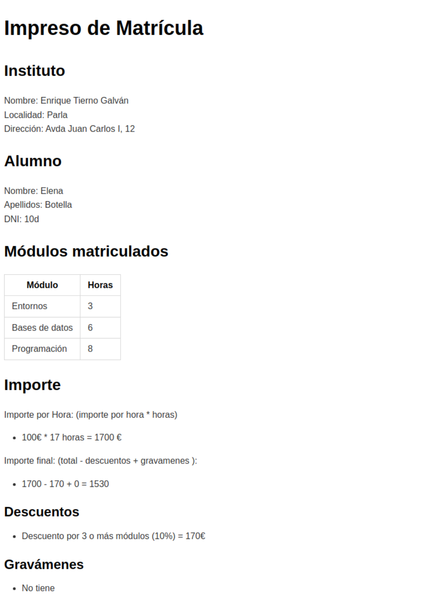
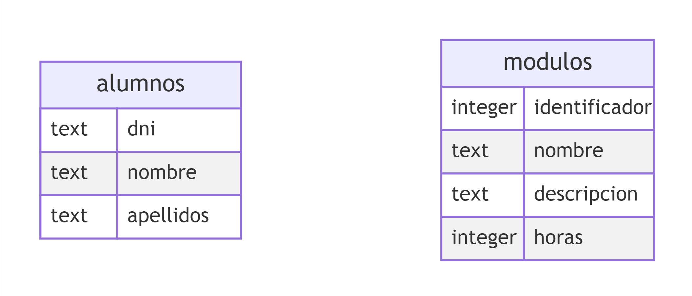
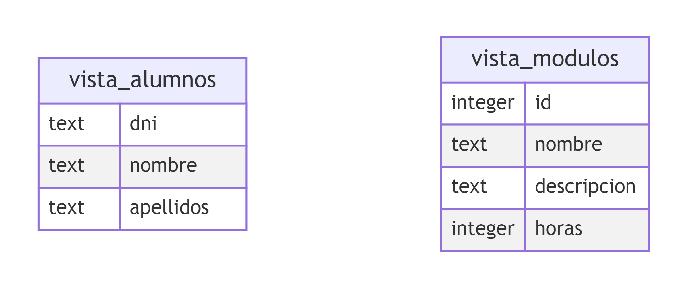
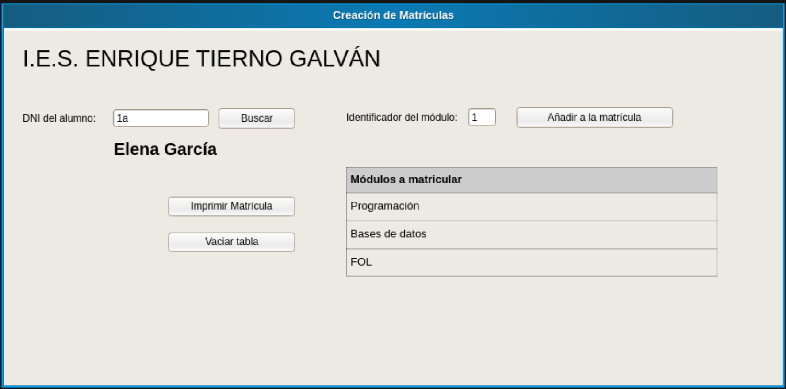

### 17. Simulacro.md

* [Simulacro de programación](https://aulavirtual32.educa.madrid.org/ies.tiernogalvan.parla/mod/book/view.php?id=19136&chapterid=1981#simulacro-de-programaci%C3%B3n)
  * [Matrícula](https://aulavirtual32.educa.madrid.org/ies.tiernogalvan.parla/mod/book/view.php?id=19136&chapterid=1981#matr%C3%ADcula)
    * [Observaciones](https://aulavirtual32.educa.madrid.org/ies.tiernogalvan.parla/mod/book/view.php?id=19136&chapterid=1981#observaciones)
  * [Base de datos](https://aulavirtual32.educa.madrid.org/ies.tiernogalvan.parla/mod/book/view.php?id=19136&chapterid=1981#base-de-datos)
    * [Sentencias de selección en SQL](https://aulavirtual32.educa.madrid.org/ies.tiernogalvan.parla/mod/book/view.php?id=19136&chapterid=1981#sentencias-de-selecci%C3%B3n-en-sql)
  * [Prototipo](https://aulavirtual32.educa.madrid.org/ies.tiernogalvan.parla/mod/book/view.php?id=19136&chapterid=1981#prototipo)
    * [Comprobación de errores](https://aulavirtual32.educa.madrid.org/ies.tiernogalvan.parla/mod/book/view.php?id=19136&chapterid=1981#comprobaci%C3%B3n-de-errores)
  * [Entregables](https://aulavirtual32.educa.madrid.org/ies.tiernogalvan.parla/mod/book/view.php?id=19136&chapterid=1981#entregables)
  * [Criterios de evaluación y calificación](https://aulavirtual32.educa.madrid.org/ies.tiernogalvan.parla/mod/book/view.php?id=19136&chapterid=1981#criterios-de-evaluaci%C3%B3n-y-calificaci%C3%B3n)
  * [Recomendaciones](https://aulavirtual32.educa.madrid.org/ies.tiernogalvan.parla/mod/book/view.php?id=19136&chapterid=1981#recomendaciones)
  * [Plantilla de código](https://aulavirtual32.educa.madrid.org/ies.tiernogalvan.parla/mod/book/view.php?id=19136&chapterid=1981#plantilla-de-c%C3%B3digo)

# Simulacro de programación

Se te ha contratado para realizar una aplicación que permita la gestión de las matriculaciones de los alumnos.

Actualmente el centro cuenta con una base de datos donde se registran la oferta de módulos disponibles y los alumnos registrados en el centro.

Se pide que realices una aplicación que dado un alumno, te permita seleccionar los módulos profesionales que dicho alumno quiera cursar (para añadirlos a su matrícula) y se "imprima" la matrícula de dicho usuario(se entiende por imprimir guardar en fichero con formato markdown, html o saltos de línea/tabuladores).

En el impreso de la matricula deberá aparecer el precio de la misma que se calcula como el número de horas * 100 €. A este precio, se le deben aplicar los siguientes descuentos/gravámenes (en el siguiente orden):

* Si cursa 3 módulos o más se le reduce el 10% del valor inicial.
* Si el número de horas totales es múltiplo de 2, se le reduce un 2% del valor inicial.
* Si el número de horas totales es múltiplo de 3, se le reduce un 3% del valor inicial.
* Si el número de horas totales es inferior a 7, se le aplica una tasa de 100 € adicionales.
* Si el número de horas totales el múltiplo de 5, se le aplica una tasa de 20€ adicionales.

Cuando se imprime una matricula se mostrará un mensaje por pantalla indicado que ha ido de forma correcta o si ha dado error.

La aplicación será vendida a todos los institutos del país por lo que el nombre, localidad y dirección del instituto deberán ser parametrizables de alguna manera.

## Matrícula

El impreso de la matricula deberá tener el siguiente formato:



### Observaciones

> El importe por hora y total se puede poner directamente, sin realizar cálculos ni poner las fórmulas:

```
    Importe por hora = 1700
    Importe final = 1530
```

> El listado de descuentos y gravámenes aplicados debe figurar en la matricula. No es necesario mostrar el importe:

```
### Descuentos

- Descuento por 3 o más módulos (10%)

### Gravámenes

- No tiene
```

## Base de datos

La base de datos cuenta con la siguiente estructura:

Tablas:



Vistas:



### Sentencias de selección en SQL

`SELECT [campos] from [tabla/vista] where [condiciones]`

Ejemplo de una consulta en sql

```
SELECT dni, nombre, apellidos from alumnos
```

## Prototipo



Funcionalidad:

* Al introducir el DNI del alumno y pulsar buscar se debe mostrar el nombre del alumno (en el ejemplo Elena García). Así mismo, se debe inicializar la tabla (debe estar vacía).
* Al introducir el identificador de un módulo y darle a añadir a la matrícula, se incorpora el módulo a la lista de módulos a matricular.
* Al pulsar el botón Imprimir matrícula, se imprime la matrícula.
* Al pulsar vaciar tabla, la tabla de módulos se vacía.

### Comprobación de errores

La aplicación mostrará un mensaje de error si:

* El dni del alumno no existe
* El identificador del módulo no existe
* Se intenta imprimir una matrícula sin módulos
* Se intenta imprimir una matrícula sin seleccionar un alumno
* Se intenta añadir un módulo sin seleccionar un alumno.

## Entregables

Se entregará un fichero ZIP con el contenido desarrollado por el alumno.

**Es obligatorio redactar un fichero README.md de aparezca:**

* Nombre y apellidos del alumno
* Apartados desarrollados (por ejemplo 1.1, 2.1, 2.2, 3.2... )
* Consideraciones del desarrollo: todo lo que el alumno quiera resaltar o remarcar (elementos particulares o desarrollo particular).

## [Criterios de evaluación y calificación](https://aulavirtual32.educa.madrid.org/ies.tiernogalvan.parla/mod/book/view.php?id=19135 "Criterios de Evaluación y Calificación")

En la corrección de los ejercicios solicitados se tendrá en cuenta la corrección en la redacción de código. **No codificar utilizando la normativa, estilo, orden y convención de nombres supondrá una reducción considerable de la nota: (0,5 puntos por falta cometida)**

1. Interfaz de usuario ( **máximo 3 puntos** )
   1. Se realiza con JavaFX, Swing, AWT: 2 puntos
      1. Se realiza en terminal: 0,5 puntos
   2. Realiza los controles en la interfaz gráfica para la comprobación de errores: 1 punto.
2. Funcionamiento completo de la aplicación ( **máximo 1 punto** )
   1. Inicia la interfaz gráfica y prepara el resto de dependencias 0,5 puntos
   2. Funcionan los flujos correctamente: desde la interfaz se piden cosas y éstas se resuelven y se informa al usuario o se ven por pantalla. 0,5 puntos
3. Acceso a la base de datos ( **máximo 2 puntos** ):
   1. Si se realiza a sqLite: 2 puntos
      1. Si se realiza con un mock 0,25 puntos
4. Impresión de la matrícula ( **máximo 3 puntos** )
   1. Formato del la matricula: 0,5 puntos
   2. Cálculo del precio + descuentos + gravámenes: 1,5 puntos.
      1. Si solo se calcula el precio de horas * tarifa: 0,25 puntos
   3. Generar un fichero con la matricula: 1 punto.
      1. Mostrar por pantalla/consola el informe de matriculación: 0,25 puntos
5. Permitir parametrizar la aplicación para ser usada en diferentes centros: **1 punto**

Se debe tener en cuenta que el código debe compilar sin errores, el código que no compile o presente errores será valorado con la calificación de 0.

Se debe buscar una solución bien estructurada donde se maximice la cohesión y se reduzca el acomplamiento. Si no se cumple se reducirá en 2 puntos la calificación final de la solución.

Si la solución no es legible será calificada con 0.

## Recomendaciones

* Se recomienda realizar un diseño arquitectónico, **no se pide**
* Se recomienda realizar un diseño de los artefactos de programación y sus relaciones,**no se pide**
* Se recomienda utilizar mocks (o funcionalidad simulada) para aquellas partes que estén incompletas o no funcionen para realizar el resto de apartados.
* Se recomienda utilizar JUnit para probar que las diferentes partes funcionan correctamente. **Siempre y cuando se hagan pruebas mínimamente completas**

> NOTA: Todo aquello que se pueda probar que funciona correctamente con JUnit, será valorado con independencia del resto de apartados. **Se deberá indicar en el fichero README.md las pruebas que pueden ser ejecutadas y el apartado de la misma**

## Plantilla de código

Para la codificación del proyecto se puede utilizar la siguiente plantilla:

`https://github.com/julparper/java_template`

> Nota: La plantilla tiene unos valores por defecto establecidos que deberán ser ajustados al desarrollo realizado por el alumnado.
>
